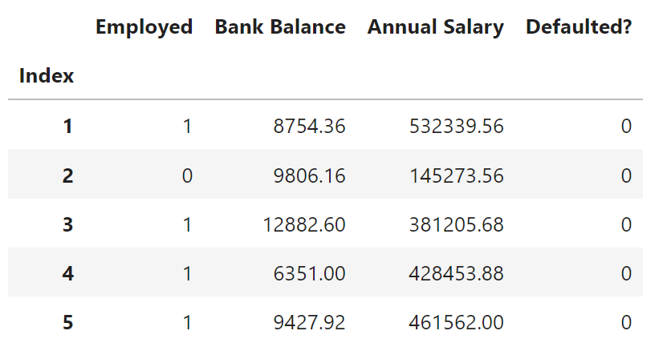

# Loan default classification

**Highlights** : Classification, imbalanced data, default detection

## 1. Introduction

Default prediction is a classic problem in financial institution. Based on the [loan default dataset](https://www.kaggle.com/datasets/kmldas/loan-default-prediction) from Kaggle, we first deal with **data imbalance** by `SMOTE` upsampling.Then we build multiple models including `Logistic regression`, `SVM`, `Random forest`, `LightGBM`, `XGBoost` to do the classification. 

**_The full modeling steps are in this [jupyter-notebook](https://github.com/NuoLeiNYU/loan-default-classification/blob/master/loan-default-classification.ipynb)_

## 2. Data description

> This is a synthetic dataset created using actual data from a financial institution. The data has been modified to remove identifiable features and the numbers transformed to ensure they do not link to original source (financial institution).
> -- <cite> [KAMAL DAS](https://www.kaggle.com/datasets/kmldas/loan-default-prediction) </cite> from Kaggle.

This dataset contains 10000 samples. The binary predicted variable is `Defaulted?`. The predictors are `Employed`, `Bank Balance`, `Annual Salary`.

## 3. Data distribution

### 3.1. Categorical feature distribution

### 3.1. Continuous feature distribution

Bank balance distribution

Annual salary distribution

## 4. Model result

|    Model    | Logistic Regression |  SVM | Random forest | LightGBM | XGBoost |
|:-----------:|:-------------------:|:----:|:-------------:|:--------:|:-------:|
| Recall Rate |         0.85        | 0.87 |      0.87     |   0.69   |   0.77  |

## 5. Conclusion

In this notebook we deal with a imbalanced loan default dataset with various ML models. 

Our experiment result shows that `SVM` and `Random Forest` model performs the best on test set with a `Recall` rate of **87%**.

But `Logistic Regression` model stands out of all other models with the best AUC of **0.5238** in `precision-recall curve`.

In the future the result may be further improved give more features and more feature engineering.